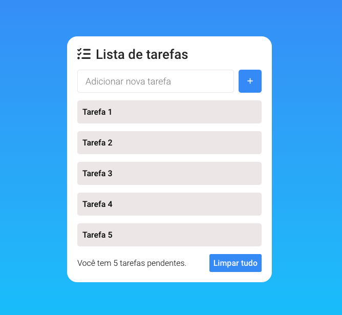
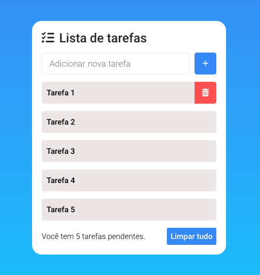

<h1>To-do List desenvolvido com JavaScript.</h1>
 

O to-do list desenvolvido conta com botões para inserir novos itens, remover um item, ou remover todos os itens.

Para a persistência e armazenamento dos dados foi utilizado o localStorage.

